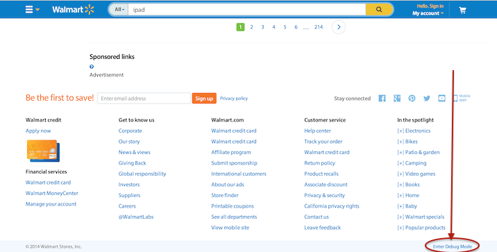

## Atlas Debugging Guide

### Overview

This document overviews the concepts and conventions what should be followed to create pages which are easy to debug in case of potential problems.

### Embed debug information in pages

#### Server-side Templates

Debug information can be embedded in server-side templates with the `{{#debug}} Debug information... {{/debug}}` helper.
You can put whatever information you deem necessary inside the debug block, in the simplest case it will be simply the serialized raw data based on which the UI components are rendered.
If you need frequently copy-paste the debug information. e.g. endpoint url, you can use {{#debug mode="textarea"}} Debug information... {{/debug}}, with the mode="textarea", the debug information
will be wrapped in a readonly textarea, and click on it will not trigger collapsing the debug block.

An example:

```html
<ul class="tile-list tile-list-grid">
  {{#each searchResults.items}}
    <li class="tile-grid-unit-wrapper">
      <div class="js-tile tile-grid-unit">
        ...
      </div>
      {{#debug}}{{this}}{{/debug}}   {{! It should be added as a child to the container which it pertains to }}
      {{#debug mode="textarea"}}{{this}}{{/debug}}   {{! It should be added as content of textarea to the container which it pertains to }}
    </li>
  {{/each}}
</ul>
```

#### Debugging Mode

To see the debug information embedded in the pages, you have to enter debug mode.

* Open any page, and click *“Enter debug mode”* on the bottom right corner of the page: (can’t find it? see [FAQ](#faq) below)

 

* Now you can see all **containing elements** of the debug blocks **highlighted**, and if you **click** on them you can **toggle the visibility** of the debug information:

 

**Tip:** You can also add the hash `#debugmode` to any page URL and debug mode will be automatically enabled on page load. This might be handy when sending URLs to QA.

##### FAQ

* Isn’t it slowing down production code?
  * The expression inside the `{{#debug}}` helper should only evaluate if debug mode is enabled for the specific environment (governed by `atlas-core/src/main/resources/frontendEnvConfig/{env}/debugmode.properties`). There should be no performance penalty when that is disabled (like for “prod”). So be verbose!
* Can’t find the *“Enter debug mode”* link?
  * Make sure that you have the following param added to your `CATALINA_OPTS: "-Dcom.walmart.atlas.config.env=dev”` (https://gecgithub01.walmart.com/GlobalProducts/atlas#getting-started Step#10)
* What else is debug mode doing?
  * It also shows you a global debug footer, where atlas-core debug information is rendered. If you have anything to add there, do it! It has to be done in the GlobalFooter.java and GlobalFooter.hbs. One thing we plan to add is a timeline depicting all invoked views and services for that request.
