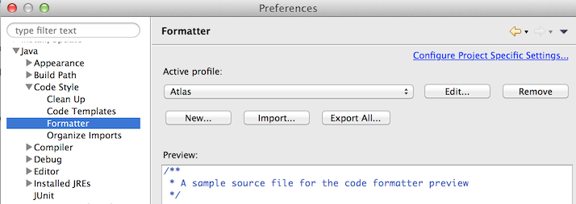

Configuring Eclipse w. Gradle (Kepler Release)
------------------------------------
##### Import Atlas
  
  * Install [Eclipse Kepler](http://www.eclipse.org/downloads/packages/node/1081) 
  
  * Start Eclipse (if Eclipse ask for a workspace, please create one specific for atlas. If you already have Eclipse, please create a new workspace for this project.  This will help prevent possible conflicts with your other projects.)
  
  * Install Gradle plugin for eclipse. Instructions can be found here https://github.com/spring-projects/eclipse-integration-gradle/#installing-gradle-tooling-from-update-site
  
  * (Optional) Install the M2Eclipse and M2Eclipse WTP if you are missing that. Instructions are found here http://marketplace.eclipse.org/content/maven-integration-eclipse-wtp#.U0_iNeZdWDG
  
  * Open Project Explorer - Window > Show View > Project Explorer
  
  * Right click on Project Explorer area then - Import > Import or File > Import
  
  * Select Gradle > Gradle Project
  
  * Browse to your "atlas" cloned directory - Click Build Model and after Gradle loads all the sub projects select Atlas and click Flinish
  
 
 
  * Enable Gradle View thru View -> Show View -> Other -> Gradle -> Gradle Tasks
  
  *  You can Right click on any project and run Gradle tasks from the "Gradle" sub-menu
 
##### Setup Debugger in Eclipse w/local Tomcat

 * Under debug icon click on Debug configurations…
 
 
 
 * Select Remote Java Application and click on the New Configuration icon. For project browse to Atlas
 
 
 
 * Click on the source tab and click Add.. -> Java Library -> Select all atlas projects -> Apply and Close 
 
 
  
 * Ensure in CATALINA_OPTS the variable is set 
 
 `-agentlib:jdwp=transport=dt_socket,server=y,suspend=n,address=8000` 
 
 * In the terminal, start your tomcat server normally
 
 `catalina run`
 
 * As an alternate, you can run tomcat in debug mode `catalina jpda run` and not have the `-agentlib` setting in CATALINA_OPS 
 
 * Start eclipse debug instance Debug -> Remote tomcat Server (name of the debug instance)
 
 * Add break points in eclipse source code and you are done
  
##### Setup Styles
  
  * Before touching the code, import the Atlas code style settings. Open Eclipse > Preferences - Java > Code Style > Formatter. Click on "Import..." and browse to "atlas/docs/code-style/resources/atlas-eclipse-kepler-v1.xml". Make sure the active profile is "Atlas".
 
 
##### (DEPRECATED) Creating an internal Tomcat Instance

  * Window > Show View > Servers
  * go to Servers Tab View > Right Click > New Server
  * Select Apache > Tomcat v7.0 Server Click Next
  * Select "cart + checkout + product + test" > Click "Add" > Click Finish
  * Double click the server you have created and select "Open launch configuration"
 
  * Select "Arguments" tab, and add this line "-Dcom.walmart.platform.config.runOnEnv=dev" to the end of the arguments. Click "Apply", Click "OK"
  * In order to test preview environmen in your local, add this also: -Dapp.preview=true
 
  * If you run into, out of memory issue. Select "Arguments" tab, and add this line "-XX:+CMSClassUnloadingEnabled -XX:+CMSPermGenSweepingEnabled -XX:MaxPermSize=512m" to the end of the arguments. Click "Apply", Click "OK"
  * Right click on the server you created > Start
