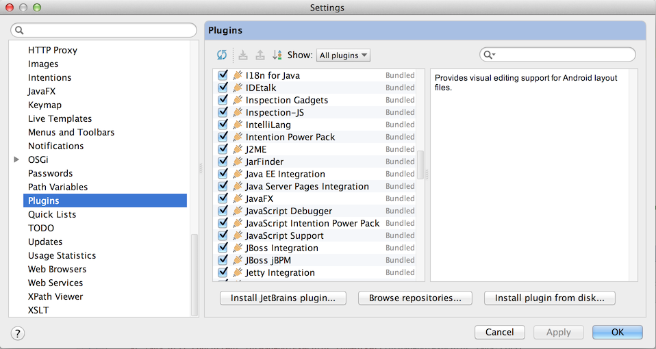
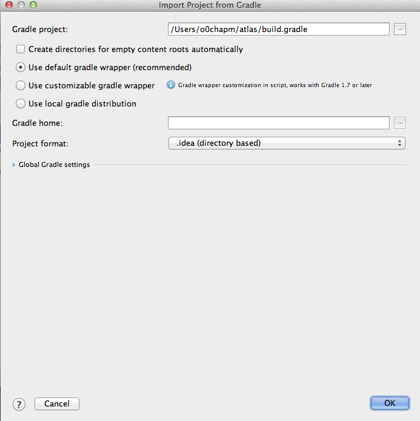
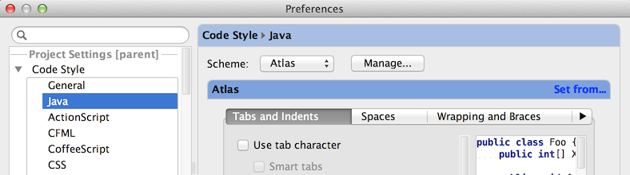
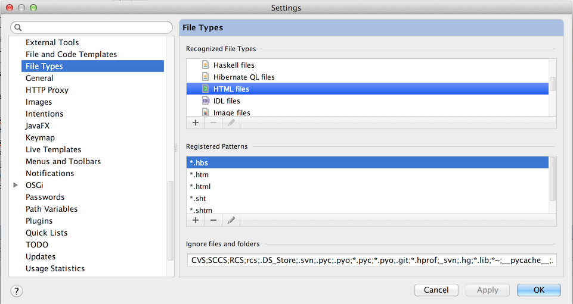
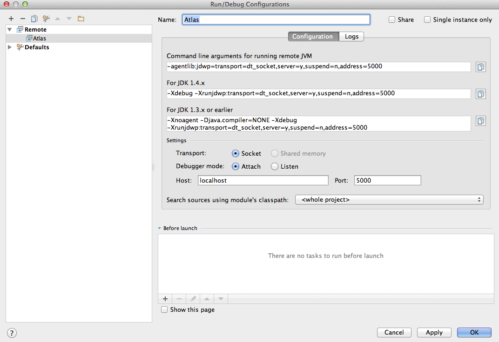

Configuring IntelliJ IDEA
=========================

IDEA 13 Ultimate Edition
------------------------

*Note*: This tutorial was created using IDEA 13.1.2.

### Initial Setup
* Follow [Getting Started](https://gecgithub01.walmart.com/GlobalProducts/atlas#getting-started) instructions, to install tomcat and complete an initial full `gradlew` build.
* *Important:* set the `TOMCAT_WEBAPPS_DIR` environment variable to `$CATALINA_BASE/webapps`.

### Installation
* [Download](http://www.jetbrains.com/idea/download/) and install. _(Btw: it is possible to restart the 30 day trial...)_
* *Important:* If you are on a MAC, make sure that IntelliJ is using 1.7 version of Java, otherwise your set up will fail.
   To change, edit this file:
   
/Applications/<Product>.app/Contents/Info.plist file (from 1.6 to 1.7)
  ```
<key>JVMVersion</key>
<string>1.7*</string>
  ```
* During startup it will ask for what plugins to enable. I found it easiest to enable all of them, and later on, when everything works, disable unnecessary ones.
 

### Import Atlas
* Open `File` -> `Import Project`. Browse to your `atlas` folder, and choose `build.gradle`, click `OK`.
 
* On the first page of the wizard everything should be default.
* Next page, everything should default, too.
 
* You are all done. To verify, navigate to one of the Java source files, and make sure that all includes are resolved (no red underlines).

### Project Configuration
* Before touching the code, import the Atlas code style settings. Copy the file `atlas/docs/code-style/resources/atlas-intellij-13-v1.xml` to `~/Library/Preferences/IntelliJIdea13/codestyles/Atlas.xml`. Restart IDEA and open `IntelliJ IDEA` -> `Preferences` and browse to `Code Style`, and activate the "Atlas" profile.
 
* Also in preferences, browse to `File Types`. Assign `*.hbs` to `HTML files` and `*.styl` to `LESS files` (as there is no handlebars, nor stylus plugin for IDEA (as of yet)).
 

### Configuring Remote Application Server
* With the Atlas project open, go to `Run` -> `Edit Configurations`. Using the `+` button, create a new `Remote` configuration.
  
* At the top of the dialog, update the Name field to something like `Atlas`.
* Near the middle, right side of the dialog, update the Port field from `5005` to `8000` (the `address` value you set in your `setenv.sh` file as part of your tomcat setup).
  
* Click `OK`.

### Remote Debugging
* In a shell window, if not already running, execute `catalina start`.
* In IntelliJ, select `Run -> Debug...`, select your remote configuration.
* The `5 Debug` panel should display near the bottom and `Connected to the target VM, address: 'localhost:8000', transport: 'socket'` should appear.
* (Optional) It can be helpful to be aware of tomcat's log file by executing `tail -f $CATALINA_BASE/logs/catalina.out`.
* (Optional) In another shell window, change to `atlas` directory, execute `./gradlew live`. This will keep your deployed Java code up-to-date as you save changes.
* (Optional) In yet another shell window, change to the `atlas` directory, execute `cd frontend; grunt live`. This will keep your deployed CSS and Javascript code up-to-date.

### Helpful Plugins
* Stylus `handles styl files`
* Handlebars `handles hbs files`
* Markdown `good for writing documentation`
* GenerateSerialVersionUID - if you need to generate something like 
  `private static final long serialVersionUID = -9166628824887901605L;`

### Exclude directories
You can modify your `atlas.iml` file to exclude these build paths. 
This will prevent excessive indexing if you have a watcher that triggers builds frequently.
Also when finding files you will not be presented with multiple files with the same name.

Note: There seems to be some bug with IntelliJ wiping the content `atlas.iml`, be sure to have a backup.

```
<?xml version="1.0" encoding="UTF-8"?>
<module external.linked.project.path="$MODULE_DIR$" external.root.project.path="$MODULE_DIR$" external.system.id="GRADLE" external.system.module.group="com.walmart.atlasGradle" external.system.module.version="4.0.0-SNAPSHOT" type="JAVA_MODULE" version="4">
  <component name="FacetManager">
    <facet type="Spring" name="Spring">
      <configuration>
        <fileset id="fileset" name="Spring Application Context" removed="false">
          <file>file://$MODULE_DIR$/docs/style-guide/static/WEB-INF/spring/context.xml</file>
          <file>file://$MODULE_DIR$/frontend/test/static/WEB-INF/spring/context.xml</file>
        </fileset>
      </configuration>
    </facet>
  </component>
  <component name="NewModuleRootManager" inherit-compiler-output="false">
    <output url="file://$MODULE_DIR$/build/classes/main" />
    <output-test url="file://$MODULE_DIR$/build/classes/test" />
    <exclude-output />
    <content url="file://$MODULE_DIR$">
      <excludeFolder url="file://$MODULE_DIR$/.gradle" />
      <excludeFolder url="file://$MODULE_DIR$/.vagrant" />
      <excludeFolder url="file://$MODULE_DIR$/account/build" />
      <excludeFolder url="file://$MODULE_DIR$/account/src/main/webapp/gen" />
      <excludeFolder url="file://$MODULE_DIR$/api/build" />
      <excludeFolder url="file://$MODULE_DIR$/atlas-core/build" />
      <excludeFolder url="file://$MODULE_DIR$/atlas-core/src/main/webapp/gen" />
      <excludeFolder url="file://$MODULE_DIR$/build" />
      <excludeFolder url="file://$MODULE_DIR$/buildSrc" />
      <excludeFolder url="file://$MODULE_DIR$/cart/build" />
      <excludeFolder url="file://$MODULE_DIR$/category/build" />
      <excludeFolder url="file://$MODULE_DIR$/checkout/build" />
      <excludeFolder url="file://$MODULE_DIR$/frontend/dependencies" />
      <excludeFolder url="file://$MODULE_DIR$/frontend/examples/js" />
      <excludeFolder url="file://$MODULE_DIR$/frontend/js-dist-atlas" />
      <excludeFolder url="file://$MODULE_DIR$/frontend/js-dist-frontend" />
      <excludeFolder url="file://$MODULE_DIR$/frontend/node_modules" />
      <excludeFolder url="file://$MODULE_DIR$/frontend/test/css" />
      <excludeFolder url="file://$MODULE_DIR$/frontend/test/static" />
      <excludeFolder url="file://$MODULE_DIR$/frontend/test/templates" />
      <excludeFolder url="file://$MODULE_DIR$/gradle" />
      <excludeFolder url="file://$MODULE_DIR$/homepage/build" />
      <excludeFolder url="file://$MODULE_DIR$/homepage/src/main/webapp/gen" />
      <excludeFolder url="file://$MODULE_DIR$/lists/build" />
      <excludeFolder url="file://$MODULE_DIR$/lists/src/main/webapp/gen" />
      <excludeFolder url="file://$MODULE_DIR$/local-gradle" />
      <excludeFolder url="file://$MODULE_DIR$/module-engine/build" />
      <excludeFolder url="file://$MODULE_DIR$/one-hour-guarantee/build" />
      <excludeFolder url="file://$MODULE_DIR$/one-hour-guarantee/src/main/webapp/gen" />
      <excludeFolder url="file://$MODULE_DIR$/pharmacy/build" />
      <excludeFolder url="file://$MODULE_DIR$/pharmacy/src/main/webapp/gen" />
      <excludeFolder url="file://$MODULE_DIR$/product/build" />
      <excludeFolder url="file://$MODULE_DIR$/product/src/main/webapp/gen" />
      <excludeFolder url="file://$MODULE_DIR$/reviews/build" />
      <excludeFolder url="file://$MODULE_DIR$/reviews/src/main/webapp/gen" />
      <excludeFolder url="file://$MODULE_DIR$/search/build" />
      <excludeFolder url="file://$MODULE_DIR$/search/src/main/webapp/gen" />
      <excludeFolder url="file://$MODULE_DIR$/static/build" />
      <excludeFolder url="file://$MODULE_DIR$/static/src/main/webapp/gen" />
      <excludeFolder url="file://$MODULE_DIR$/store/build" />
      <excludeFolder url="file://$MODULE_DIR$/store/src/main/webapp/gen" />
      <excludeFolder url="file://$MODULE_DIR$/topic/build" />
      <excludeFolder url="file://$MODULE_DIR$/topic/src/main/webapp/gen" />
    </content>
    <orderEntry type="inheritedJdk" />
    <orderEntry type="sourceFolder" forTests="false" />
    <orderEntry type="library" name="sass-stdlib" level="application" />
  </component>
</module>
```

### Additions/Questions
Feel free to extend this guide. If you have an IDEA question, join the #ide-intellij channel on Slack. You can also ping @attila.incze or @orren or @sunithagourishetty on Slack.
